# KingKong 体育 · P2P 下注流程需求说明文档（图文版）

> 版本 V2.2 · 2026-08 · 产品：Ali
> 配套原型：C 端 H5 v6.5（文中截图均取自该原型）

---

## 一、文档范围

本文档只覆盖本期有改动的模块：赛事大厅的 P2P 标识与入口、盘口详情页（新增）、购物车的买入 / 串关 / 卖出、注单确认。未改动的买单、卖单、赛果、我的等页面沿用现行实现，不在本文档展开。

| 模块 | 改动性质 |
|---|---|
| 赛事大厅 | 改造：P2P 标识与红点规则、联赛比赛数、所有盘口与 P2P 入口、P2P 筛选 |
| 盘口详情页 | 新增：展示该场全部盘口，由所有盘口 / P2P 入口进入 |
| 购物车 — 买入 | 改造：面板化、赔率展示三态、档位表与购买计划、数字键盘、自动接受任何赔率 |
| 购物车 — 串关 | 改造：按注单数激活、过关方式分行独立下注 |
| 购物车 — 卖出 | 改造：与买入同面板切换，补返回入口 |
| 注单确认 | 改造：确认中 / 已确认两态，含注单号与投注状态 |

> **术语**：官方赔率 = 平台盘口赔率；P2P 档位 = 会员挂出的卖出档位；卖一 = 卖单簿中赔率最高的可购档位；庄单 = 会员挂出的 P2P 挂单。

---

## 二、赛事大厅

| 图1 赛事大厅（默认） | 图2 P2P 筛选开启 |
|---|---|
| 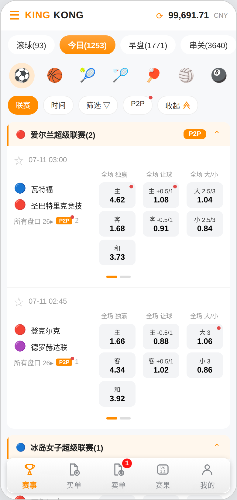 | 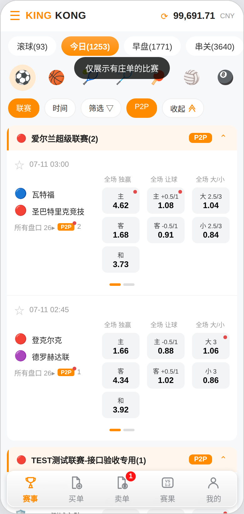 |

### 2.1 P2P 标识与红点

- 赔率格：该投注项存在不低于官方赔率的 P2P 档位时，格内展示这些档位中的最高 P2P 赔率；不存在时展示官方赔率。低于官方赔率的档位不参与取值。**赔率数值样式与官方赔率完全一致，不做颜色或字重区分，是否存在 P2P 档位仅通过红点标识**；
- 红点：存在高于官方赔率的 P2P 档位时，赔率格右上角展示红点；红点常驻不因点击消失，仅当该投注项已无高于官方赔率的 P2P 档位（被买空、下架或赔率回落）时自动消失；档位仅等于官方赔率时不展示红点；
- 联赛标签：联赛内至少一场比赛存在庄单时，联赛头右侧展示「P2P」标签；无庄单的联赛不展示（图1 中冰岛女子超级联赛即为无标签状态）；
- 筛选胶囊：有新的 P2P 注单时「P2P」胶囊上展示红点，点击后红点消失。

### 2.2 联赛与比赛信息

- 联赛头：联赛名后展示该联赛内的比赛数，如「爱尔兰超级联赛(2)」；可整组折叠；
- 比赛卡片底部（队伍名下方）展示两个入口：
  - **「所有盘口 N▸」**：始终展示，**N 为该场比赛的投注项数量**（与盘口详情页展示的赔率格总数一致）；
  - **「P2P N」**：仅当该场存在不低于官方赔率的庄单时展示，**N 为该场存在 P2P 庄单的投注项数量**；带红点，点击后红点消失；
- 两个入口均进入同一个盘口详情页，不做内容差异。

### 2.3 P2P 筛选

- 点击「P2P」胶囊进入选中态，数据区仅展示有庄单的比赛，无庄单的联赛整组隐藏（图2）；
- 再次点击取消筛选，恢复全部比赛。

---

## 三、盘口详情页（新增）

| 图3 盘口详情（全部） | 图4 按「让球」筛选 |
|---|---|
| 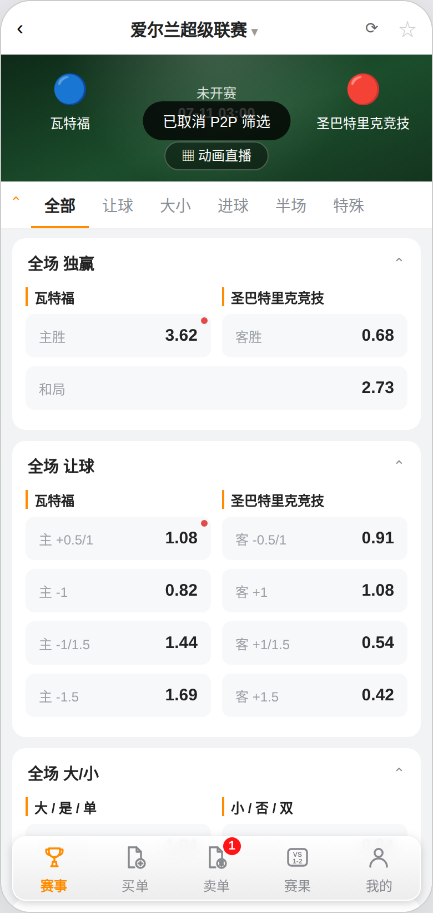 | 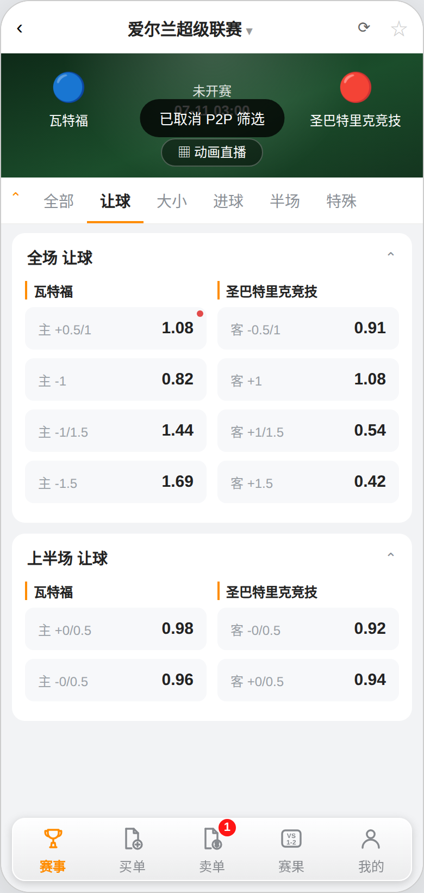 |

- 入口：比赛卡片底部的「所有盘口」或「P2P」；
- 顶栏：返回、联赛名、刷新、收藏；
- 赛事横幅：主客队徽标与队名、赛事状态（未开赛 / 滚球中）、开赛时间、动画直播入口；
- 玩法 Tab：全部 / 让球 / 大小 / 进球 / 半场 / 特殊，切换后仅展示对应玩法分组；
- 盘口分组：按玩法分组展示（全场独赢、全场让球、全场大小、上半场各玩法、进球、特殊等），每组可折叠；主客两列并排，列头为队名并带橙色竖条；
- 赔率格规则与赛事大厅一致：有更优 P2P 档位时展示最高 P2P 赔率并带红点（同样常驻，不因点击消失）；点击即选中并加入购物车，选中态为橙色底；
- 底部导航保持可见，可直接切换到其他一级页面。

---

## 四、购物车 — 买入

| 图5 已输入金额（购买计划） | 图6 数字键盘展开 |
|---|---|
| 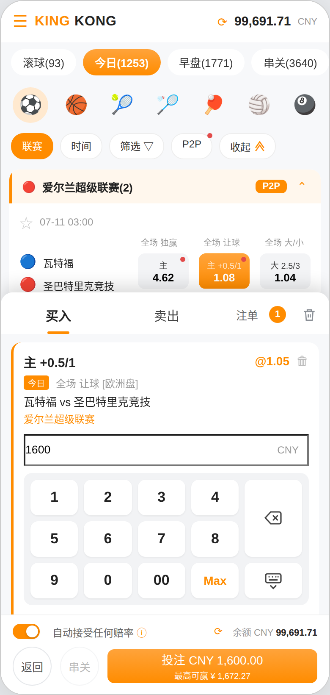 | 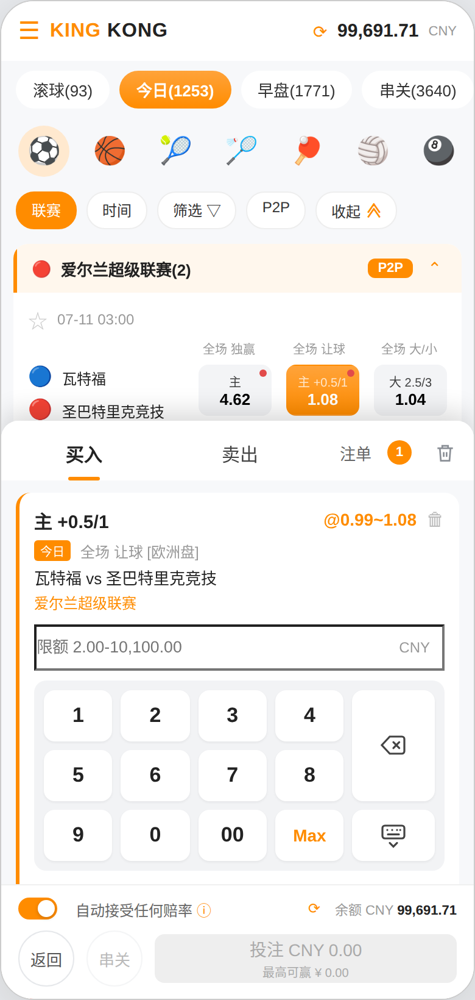 |

### 4.1 面板形态与入口

- 购物车为底部固定面板（约占屏高 58%），不使用弹窗、不对赛事列表加蒙层；面板打开时赛事列表仍可滚动、赔率格仍可点击，选中新投注项实时加入购物车；
- 顶部：买入 / 卖出 Tab（串关模式下仅保留串关 Tab）、注单数、清除（清空全部注单）；
- 底部固定区：自动接受任何赔率开关与说明入口、余额；按钮行为「返回」「串关 / 单关」「投注 CNY 合计」，投注按钮内附最高可赢；
- 「返回」收起购物车回到赛事列表，已选注单保留。

### 4.2 投注卡片与赔率展示

卡片内容：投注项、赛事状态标签、玩法与盘口类型、赛事、联赛、赔率、金额输入框、档位表。卡片右上角赔率按三种情形展示：

| 情形 | 赔率展示 |
|---|---|
| 未开启自动接受任何赔率 | 展示最高赔率（含 P2P 档位） |
| 已开启 + 存在高于官方的档位 + 未输入金额 | 展示区间【官方赔率~P2P 最高赔率】 |
| 已开启 + 已输入金额 | 展示按购买计划算出的加权平均赔率，公式见下 |

**加权平均赔率计算公式：**

```
加权平均赔率 =（档一成交金额 × 档一赔率 + 档二成交金额 × 档二赔率 + … + 官方档成交金额 × 官方赔率）÷ 输入金额
```

- 各档成交金额即「购买计划」列的数值：被完整吃满的档位等于该档可购额度，最后一个档位为剩余金额；
- 各档成交金额之和恒等于输入金额，因此分母直接取输入金额；
- 举例（图5）：档位为 卖一 @1.08 可购 195、卖二 @1.05 可购 952.38、卖三 @1.02 可购 8,888，输入 1,600。购买计划为 195 / 952.38 / 452.62，加权平均赔率 =（195×1.08 + 952.38×1.05 + 452.62×1.02）÷ 1,600 = 1,672.28 ÷ 1,600 ≈ **@1.05**，该值作为注单显示赔率。

### 4.3 档位表与购买计划

- 表头上方一行展示「官方赔率 @X」与「更优赔率可购额度总计 X CNY」（不低于官方赔率的档位可购额度合计），右侧可展开 / 收起，默认展开；
- 表体四列：档位、卖出赔率、可购额度、购买计划；官方档位额度为「无限」，固定在最后一行；本人挂出的档位标注「我」；
- 展示不低于官方赔率的全部有效档位；卖家档位超过 3 档时区域内滚动查看，不整体展开；
- 购买计划列按当前模式实时分配输入金额：开启开关时自最高赔率档位向下依次分配（图5 中 1,600 分配为卖一 195 + 卖二 1,405）；未开启时仅分配到卖一档位；
- 多张卡片时仅第一张默认展开档位表，其余默认收起。

### 4.4 数字键盘

- 金额输入框为只读框，点击在其下方展开自定义键盘；框内右侧固定展示 CNY，占位为限额区间；
- 键位：数字 1-9、0、00、Max，右侧退格（跨两行）与收起键盘；不支持小数输入；
- Max 填入当前可投上限；全局同时只展开一个键盘；键盘不被底部固定区遮挡；
- 购物车内仅 1 张卡片时键盘默认展开且不自动收起，多张卡片时默认收起。

### 4.5 自动接受任何赔率

| 图7 规则说明 | 图8 卖一额度不足提示 |
|---|---|
| 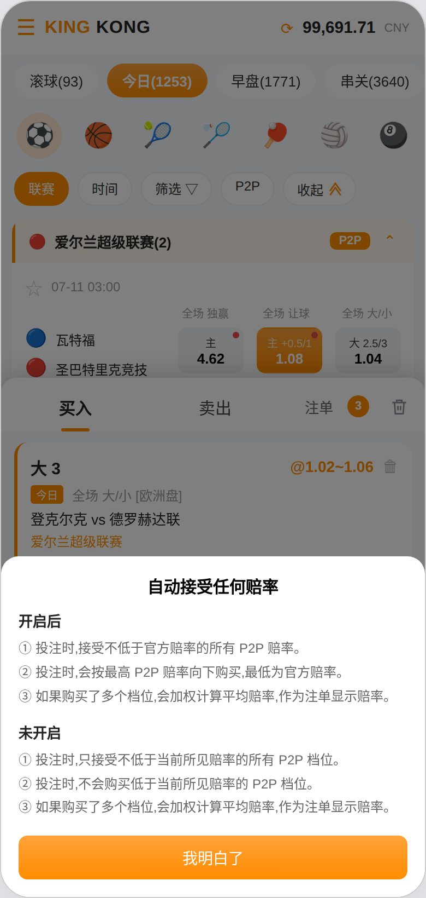 | 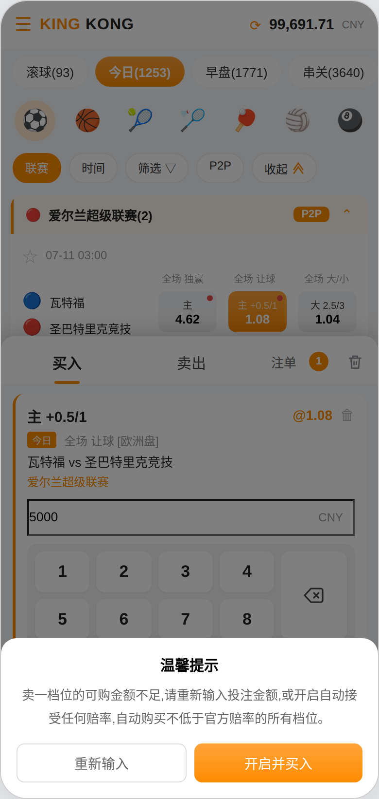 |

开关位于购物车底部固定区，与「我的 — 赔率偏好」同步，点击 ⓘ 弹出规则说明（图7）。两种模式规则：

| 模式 | 成交规则 | 可投上限 | 失败处理 |
|---|---|---|---|
| 开启 | 接受不低于官方赔率的所有 P2P 赔率；按最高 P2P 赔率向下依次购买，最低为官方赔率；购买多个档位时加权计算平均赔率作为注单显示赔率 | 不低于官方赔率的可购额度合计与系统限额中的较小值 | 赔率升高或降低均按即时赔率成交；超出系统购买上限时弹提示 |
| 未开启 | 只接受不低于当前所见赔率的 P2P 档位，不购买低于所见赔率的档位（即按卖一档位赔率成交） | 卖一档位的可购额度 | 金额超出时弹「温馨提示」（图8）；赔率下降时投注失败 |

- 温馨提示提供「重新输入」与「开启并买入」；选择后者即开启开关并立即按依序吃单完成本次投注，不需重新输入金额；

**金额输入框的限额上限：**

| 开关状态 | 限额上限取值 | 占位文案示例 |
|---|---|---|
| 未开启 | 三方返回的玩法限额上限与卖一档位可购额度取较小值 | 限额 2.00-195.00 |
| 已开启 | 三方返回的玩法限额上限 | 限额 2.00-10,100.00 |

- 限额下限恒为三方返回的最小单注限额；Max 键填入当前上限；开关切换后占位文案与 Max 取值同步刷新。

---

## 五、购物车 — 串关

| 图9 买入（多单 + 单关批量行） | 图10 串关模式 |
|---|---|
| 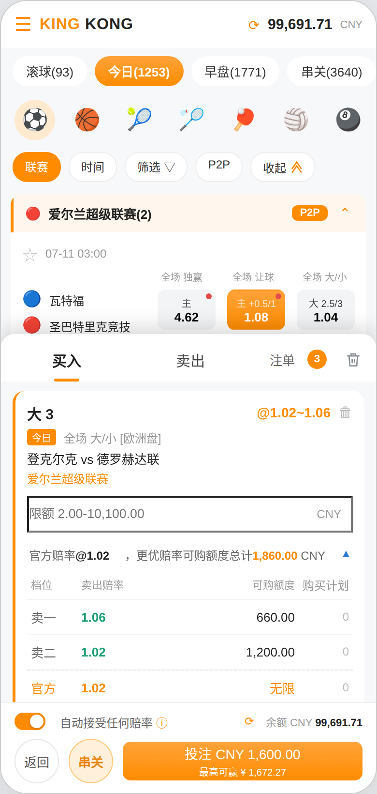 | 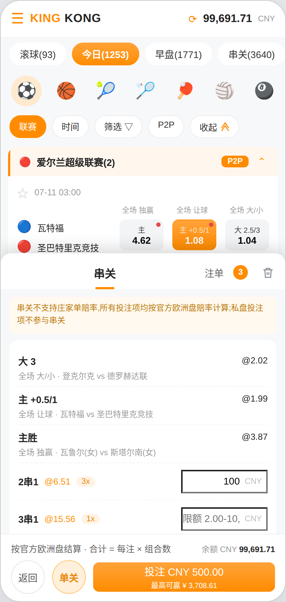 |

- 单关批量行：买入页卡片下方展示「单关 N×」与一个金额输入框，输入后统一设置全部单关注单金额（图9）；
- 串关入口：底部圆形「串关」按钮，注单数大于 1 时点亮（黄底橙字），否则置灰；点击切换到串关模式；
- 串关模式下顶部 Tab 仅保留「串关」，底部按钮变为点亮的「单关」，点击可切回买入；
- 串关不支持庄家单赔率，全部投注项按官方欧洲盘赔率计算；
- 过关方式逐行展示，每行含平均赔率、注数与独立的每注金额输入框：

| 过关方式 | 注数 | 说明 |
|---|---|---|
| N串1（2串1 … N串1） | C(N, M) | 从 N 场中任取 M 场组合，逐组合独立成注 |
| 混合过关 N串M式 | M = 全部组合数合计 | 2串1 至 N串1 的全部组合合并下注，所选投注项不少于 3 场时展示 |

- 每行合计 = 每注金额 × 该行注数；底部汇总全部行合计与最高可赢；多行可同时填写并一次提交，按行分别生成注单；
- 删除投注项至仅剩 1 个注单时自动切回买入 Tab，顶部 Tab 恢复为买入 / 卖出，串关按钮置灰；删除方式包括购物车内删除与在赛事列表取消选中，两者行为一致。

---

## 六、购物车 — 卖出

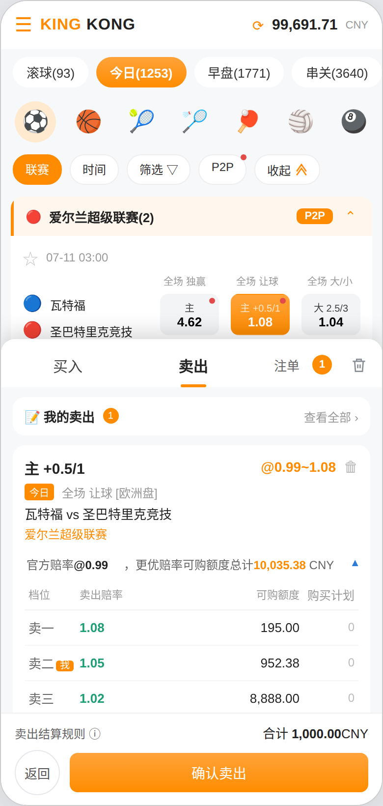

*图11 卖出（已填押金与上浮点位）*

- 与买入同面板切换，顶部「卖出」Tab 进入；卡片内容与买入一致，并展示该投注项当前档位表，便于对照定价；
- 卖出参数：押金金额、上浮点位（步进控件，可为负）；卖出赔率 = 官方赔率 + 上浮点位，只读展示；
- 预计可卖额度 = 押金 ÷ 卖出赔率（港盘），实时计算并展示公式；
- 底部展示卖出结算规则入口与合计押金；按钮行为「返回」与「确认卖出」，返回收起面板回到赛事列表；
- 顶部提供「我的卖出」入口，可跳转卖单页查看全部挂单。

---

## 七、注单确认

| 图12 注单确认中 | 图13 注单已确认 |
|---|---|
| 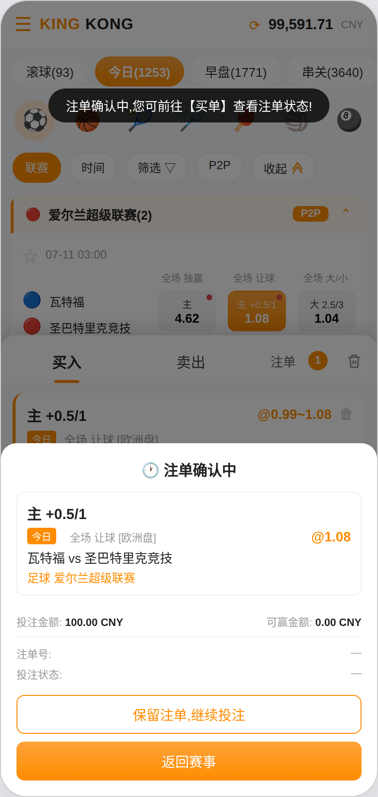 | 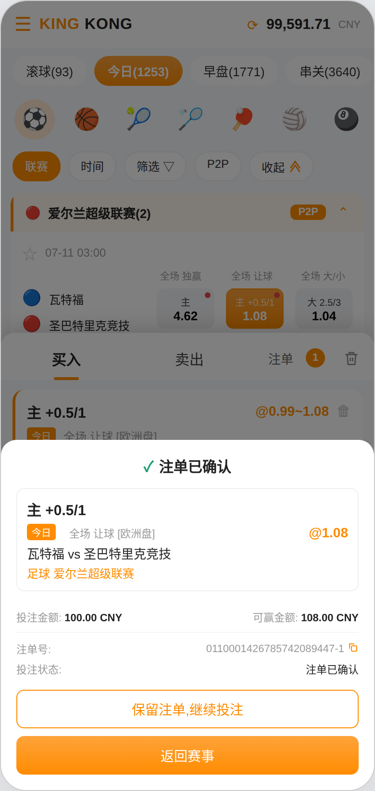 |

| 阶段 | 展示 | 操作 |
|---|---|---|
| 确认中 | 状态标识「注单确认中」+ 注单明细（投注项、状态标签、玩法与盘口、赛事、联赛、赔率）+ 投注金额；可赢金额 0.00，注单号与投注状态为「—」 | 保留注单继续投注 / 返回赛事 |
| 已确认 | 状态标识「注单已确认」；回填可赢金额、注单号（可复制）与投注状态 | 保留注单继续投注 / 返回赛事 |

- **点击投注后，toast 提示「注单确认中，您可前往【买单】查看注单状态！」**；
- 「保留注单，继续投注」关闭浮层但保留购物车内容，便于连续投注；
- 注单在提交时即写入「买单 — 未结算」，状态随确认结果更新；串关一次提交多行时各行注单分别确认。

---

## 八、配置项与输入约束

| 项目 | 取值 | 说明 |
|---|---|---|
| 自动接受任何赔率 | 开 / 关，默认关 | 会员级偏好，购物车与「我的 — 赔率偏好」同步 |
| 玩法单注限额 | 沿用现行风控配置 | 决定金额输入框限额区间与 Max 取值（原型演示 2 ~ 10,100） |
| 串关限额 | 沿用现行风控配置 | 串关每注金额上下限 |
| 卖出押金限额 | 沿用现行风控配置 | 卖出押金上下限 |

| 输入框 | 输入类型 | 范围 | 默认值 |
|---|---|---|---|
| 单关投注金额 | 正整数，不支持小数 | 下限为三方最小限额；上限见 4.5，最长 9 位 | 空 |
| 串关每注金额 | 正整数，不支持小数 | 按串关限额，最长 9 位 | 空 |
| 单关批量金额 | 正整数，不支持小数 | 按玩法限额 | 空 |
| 卖出押金 | 正数，最多两位小数 | 按风控限额 | 空 |
| 上浮点位 | 数字，最多两位小数，可为负 | 结果赔率须大于 0 | 0.01 |

对齐规则：金额与赔率靠右对齐，文本靠左对齐。

---

## 九、默认排序

| 列表 | 默认排序 |
|---|---|
| 档位表 | 赔率降序；同赔率按挂出时间升序；官方档位固定最后 |
| 购物车投注卡片 | 按选中时间升序 |
| 串关过关方式 | 2串1 → … → N串1 → 混合过关 |
| 盘口详情分组 | 全场玩法 → 上半场玩法 → 进球 → 特殊 |

---

## 十、边界场景

- 同一投注项反复选中取消：红点保持展示，不因交互清除；
- 选中后官方赔率变动：赛事大厅与购物车赔率实时刷新，已输入金额保留；
- 选中后全部 P2P 档位售罄：赔率格回落为官方赔率、红点消失，卡片档位表仅剩官方档位；
- 多卡片切换键盘：展开新键盘时其他键盘自动收起，已输入金额不丢失；
- 串关模式下删除至仅剩一场：自动切回买入，串关各行金额清空；
- 购物车打开期间取消选中：卡片同步移除，合计与最高可赢实时重算；
- 确认浮层未关闭时继续投注：允许，新注单独立确认；
- 余额不足或超出限额：提交时拦截并提示，不生成注单。

---

## 十一、本期不做

- 金额输入支持小数；
- 一键全额、跟单、复制注单等快捷下单方式；
- 串关包含 P2P 庄家赔率（沿用既有约束，按官方欧洲盘计算）；
- 提前结算与注单撤销；
- 购物车跨设备同步与草稿保存；
- 开盘坐庄（私盘）相关的下注入口，随下一期建设。

---

## 十二、验收标准（Given / When / Then）

| 场景 | Given / When / Then |
|---|---|
| 赔率格展示最高 P2P 赔率 | Given 某投注项存在高于官方赔率的 P2P 档位；When 浏览赛事大厅；Then 该赔率格展示最高 P2P 赔率并显示红点 |
| 红点常驻 | Given 赔率格显示红点；When 点击该赔率格选中或取消；Then 红点仍然展示 |
| 红点消失条件 | Given 某投注项的全部高于官方赔率的 P2P 档位被买空或下架；When 刷新赛事大厅；Then 该赔率格红点消失，赔率回落为官方赔率 |
| 联赛标签数据驱动 | Given 某联赛内所有比赛均无庄单；When 浏览赛事大厅；Then 该联赛头不展示 P2P 标签 |
| 入口数量口径 | Given 某场比赛共 26 个投注项、其中 2 个存在 P2P 庄单；When 查看比赛卡片底部；Then 展示「所有盘口 26▸」与「P2P 2」，且进入盘口详情页后赔率格总数为 26 |
| 赔率格样式统一 | Given 某赔率格存在更高的 P2P 档位；When 与同卡片内无 P2P 档位的赔率格对比；Then 两者数值颜色与字重完全一致，仅前者带红点 |
| P2P 筛选 | Given 点击「P2P」胶囊；When 进入选中态；Then 仅展示有庄单的比赛，无庄单联赛整组隐藏 |
| 两个入口一致 | Given 某场比赛有庄单；When 分别点击「所有盘口」与「P2P」入口；Then 进入同一盘口详情页，内容一致 |
| 盘口详情下单 | Given 在盘口详情页；When 点击任一赔率格；Then 该格呈选中态并加入购物车 |
| 面板不遮挡列表 | Given 购物车已打开；When 点击赛事列表中的赔率格；Then 该投注项实时加入购物车，面板保持打开 |
| 档位表全量与滚动 | Given 某投注项有 5 个不低于官方赔率的档位；When 展开档位表；Then 全部档位可查看，卖家档位区域内滚动，官方档位固定最后一行 |
| 加权平均赔率 | Given 开启开关，档位为 @1.08/195、@1.05/952.38、@1.02/8,888；When 输入 1,600；Then 购买计划为 195 / 952.38 / 452.62，卡片赔率显示 @1.05 |
| 限额上限（未开启） | Given 未开启开关且卖一可购额度 195，三方限额上限 10,100；When 查看金额输入框；Then 占位显示「限额 2.00-195.00」，Max 键填入 195 |
| 限额上限（已开启） | Given 已开启开关；When 查看金额输入框；Then 占位显示「限额 2.00-10,100.00」，Max 键填入 10,100 |
| 未开启超额提示 | Given 未开启开关且卖一可购 195；When 输入 5,000 并提交；Then 弹温馨提示，提供「重新输入」与「开启并买入」，不生成注单 |
| 开启并买入 | Given 已弹出温馨提示；When 点击「开启并买入」；Then 开关置为开启并立即按依序吃单完成本次投注 |
| 单注默认展开键盘 | Given 购物车内仅 1 张卡片；When 打开购物车；Then 键盘默认展开且不自动收起 |
| 串关按注单数激活 | Given 仅 1 个注单；When 查看底部；Then 串关按钮置灰；新增 1 个注单后按钮点亮 |
| 串关模式 Tab | Given 点击「串关」；When 进入串关模式；Then 顶部仅保留「串关」Tab，底部「单关」按钮点亮 |
| 删至一单切回买入 | Given 处于串关模式且有 2 个注单；When 删除其中 1 个；Then 自动切回买入 Tab，串关按钮置灰 |
| 混合过关展示条件 | Given 所选投注项为 2 场；When 进入串关；Then 不展示混合过关行；选至 3 场后展示 3串4式 |
| 串关多行同时下单 | Given 选中 3 场投注项；When 2串1 每注 100、混合过关每注 50 并提交；Then 合计 500，分别生成 2 笔注单 |
| 卖出参数计算 | Given 卖出页输入押金 1,000、上浮点位 0.06，官方赔率 0.99；Then 卖出赔率显示 @1.05，预计可卖额度显示 952.38 CNY |
| 投注即提示 | Given 购物车已填金额；When 点击「投注」；Then 立即 toast 提示「注单确认中，您可前往【买单】查看注单状态！」并弹出确认浮层 |
| 注单确认两态 | Given 提交投注；When 浮层弹出；Then 先展示「注单确认中」（可赢 0.00、注单号 —），确认后就地切换为「注单已确认」并回填可赢金额与注单号 |

---

*— 文档结束 —*
