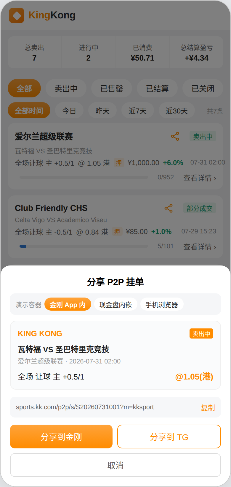
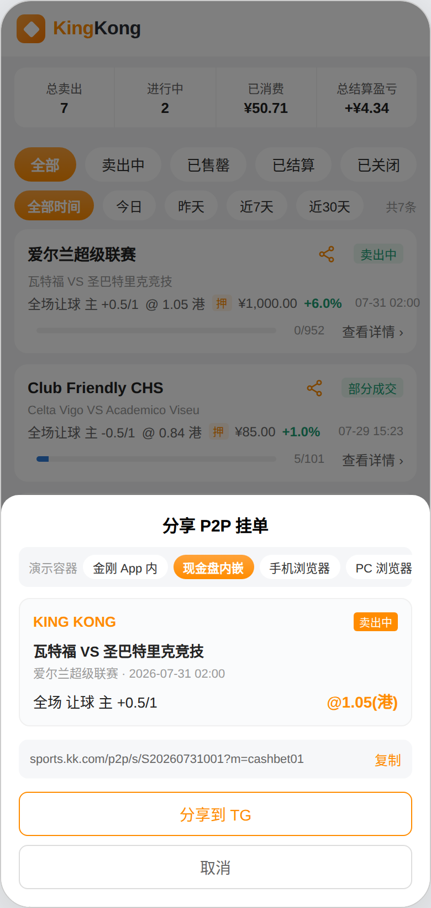
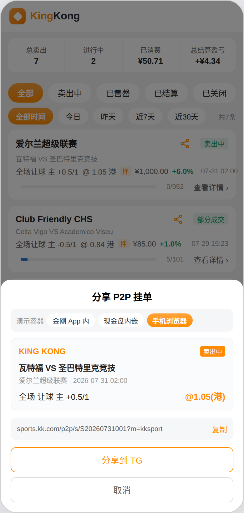
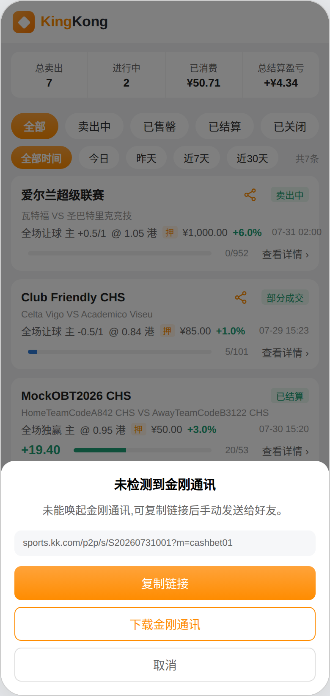
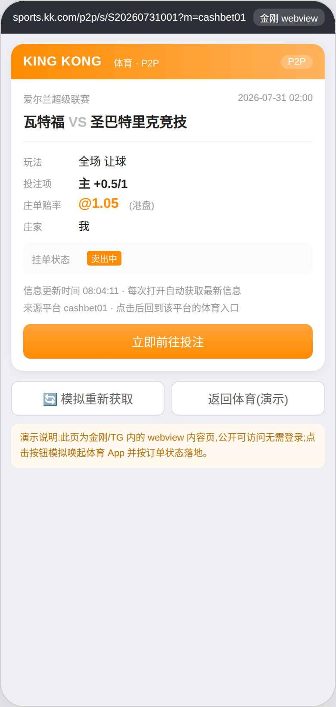
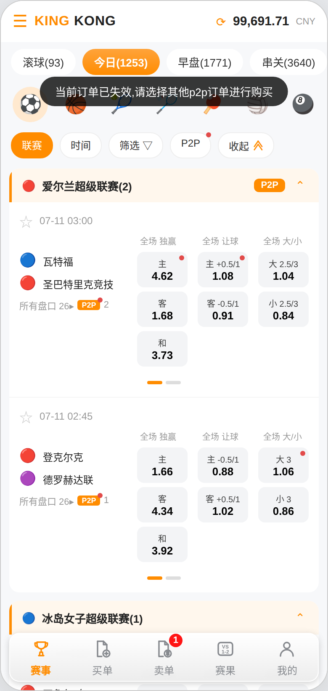

# KingKong 体育 · P2P 挂单分享功能需求说明文档

> 版本 V1.5 · 2026-08 · 产品：Ali
> 配套原型：C 端 H5 v6.8（文中截图均取自该原型；分享层内含「演示容器」切换器，仅用于演示，不上线）

---

## 一、背景与目标

P2P 挂单的曝光此前完全依赖买家主动进入体育站内浏览，庄家挂单后只能等待自然流量，冷启动期成交慢；P2P 内容也无法向站外社交场景扩散。

本期建设 P2P 挂单分享：分享对象为**单个投注项庄单**，庄家挂单后可生成公开可访问、携带订单 ID 的链接，分享至金刚会话或 Telegram；接收方点击后回到**链接所属平台**的体育入口，有效则直达投注，失效则提示并引导浏览其他挂单。

- 庄家可对自己卖出中的挂单生成分享链接并分享；
- 分享内容在金刚 webview 中呈现关键信息，无需登录即可查看，不暴露庄家资金信息；
- 内容为动态内容，每次打开自动获取最新赔率与状态；
- 接收方点击后按订单状态精准落地；
- 本期不涉及私盘（复制比赛）与调水，二者随下一期开盘坐庄建设。

---

## 二、运行容器与分享按钮展示规则

体育侧**无原生 App，只有 H5**，会运行在三类容器中。分享能力取决于宿主是否注入 IM SDK（`im2-link-jssdk`）。

| 图1 金刚 App 内 | 图2 现金盘内嵌 | 图3 手机浏览器 |
|---|---|---|
|  |  |  |

| 容器 | IM SDK | 分享到金刚 | 分享到 TG | 复制链接 | 商户归属 |
|---|---|---|---|---|---|
| 金刚 App WebView | 有 | **展示**，调 `IM.share` | 展示 | 展示 | 金刚体育默认商户 |
| 现金盘站点内嵌 | 有 | **展示**，调 `IM.share` | 展示 | 展示 | 该现金盘商户 |
| 手机浏览器 | 无 | **不展示** | 展示 | 展示 | 按进入来源判定 |

### 2.1 展示判定规则

- **分享到金刚**：以**容器判定**代替"是否已安装"——仅当宿主注入了 IM SDK（金刚 App 容器与现金盘内嵌容器均已注入）时展示。此时用户必然已安装金刚通讯，不存在唤起失败；未注入 SDK 的容器（手机浏览器）不展示该按钮；
- **分享到 TG**：常驻展示。TG 分享走网页链接 `https://t.me/share/url?url={分享链接}&text={标题}`，未安装 TG 时浏览器会打开 TG 网页版并由 TG 自带下载引导，不会出现白屏或无响应；
- **复制链接**：所有容器常驻，是最终兜底；
- 某容器下两个分享按钮都不展示时，分享层提示「当前环境不支持直接分享，请复制链接后手动发送」。

> **技术约束说明**：浏览器不提供查询"某 App 是否已安装"的接口，无法在点击前预判安装状态。因此「未安装则不展示按钮」通过上述容器判定实现；对 TG 采用"网页链接兜底"而非隐藏按钮，因为该方式在未安装时依然能完成分享。

### 2.2 唤起失败降级

用于后续可能新增的 scheme 唤起场景。判定方式：点击后尝试唤起并启动 2 秒计时，若期间 `visibilitychange` 未触发（页面未被切走），判定唤起失败。



*图4 未检测到应用时的降级弹窗*

弹窗内容：说明未能唤起该应用 + 展示完整链接 + 三个操作「复制链接」「下载对应应用」「取消」。

---

## 三、分享入口与链接

### 3.1 入口

入口仅在挂单**可被购买**时出现，失效挂单不展示分享按钮。

| 位置 | 展示条件 |
|---|---|
| 卖单列表卡片右上角分享图标 | 挂单状态 = 卖出中 / 部分成交（点击需阻止卡片跳转） |
| 庄家卖出详情页顶栏右上角分享图标 | 同上；已售罄 / 已封盘 / 已关闭 / 已结算时隐藏 |

点击后弹出分享层：内容预览卡（与接收方所见一致）、分享链接文本行（附「复制」）、按容器展示的分享按钮、「取消」。

### 3.2 链接结构

```
https://{p2p_share_host}/p2p/s/{庄单ID}?m={商户标识}

示例（金刚体育）：https://sports.kk.com/p2p/s/S20260731001?m=kksport
示例（现金盘）：  https://sports.kk.com/p2p/s/S20260731001?m=cashbet01
```

- `{庄单ID}`：该投注项庄单唯一标识，一个链接对应一笔挂单；
- `m`：**商户标识**，取分享发起时体育 H5 所在容器的商户，决定接收方点击后回到哪个平台的体育入口；缺失或非法时按金刚体育默认商户处理；
- 链接公开可访问，无需登录、无需授权，不携带任何用户身份信息；
- 链接长期有效且可重复访问：挂单失效后仍可打开，展示失效状态与引导，不返回 404；
- 同一挂单多次分享复用同一链接；本期仅支持单投注项庄单粒度。

---

## 四、分享内容页

由体育提供，在金刚或 TG 的 webview 容器内渲染，为只读内容页。



*图5 分享内容页（现金盘来源）*

### 4.1 页面字段

| 区域 | 字段 | 规则 |
|---|---|---|
| 品牌区 | LOGO 与名称 | 固定展示 KING KONG 体育标识与「P2P」标记 |
| 赛事区 | 联赛、开赛时间、主队 VS 客队 | 取实时赛事信息 |
| 挂单区 | 玩法 | 如「全场 让球」「全场 独赢」 |
| 挂单区 | 投注项 | 如「主 +0.5/1」「大 3」，加粗突出 |
| 挂单区 | 卖出赔率 | 港盘，橙色加粗，取实时值 |
| 挂单区 | 庄家 | 挂单所属庄家标识 |
| 状态区 | 挂单状态 | 卖出中 / 部分成交 / 已售罄 / 已封盘 / 已关闭 / 已结算 |
| 状态区 | 失效说明 | 非可购买态时展示原因文案 |
| 底部 | 信息更新时间 | 展示本次获取时间，并说明每次打开自动获取最新信息 |
| 底部 | 来源平台 | 展示 `m` 对应的商户，并说明点击后回到该平台的体育入口 |
| 底部 | 主按钮 | 有效：「立即前往投注」；失效：「前往查看其他挂单」 |

**不展示**：剩余可卖额度、押金、总额度等庄家资金信息。

### 4.2 实时性

- 每次页面加载或刷新均请求最新数据，**不使用缓存快照**；
- 金刚侧每次渲染 / 刷新 webview 均需重新拉取，不得复用本地缓存；
- 网络异常时展示占位与重试入口，不展示历史缓存数据。

### 4.3 状态与主按钮映射

| 挂单状态 | 内容页展示 | 主按钮 |
|---|---|---|
| 卖出中 / 部分成交 | 状态标签 + 完整挂单信息 | 立即前往投注 |
| 已售罄 | 已售罄 + 「该挂单额度已售罄」 | 前往查看其他挂单 |
| 已封盘 | 已封盘 + 「庄家已暂停该盘口收单」 | 前往查看其他挂单 |
| 已关闭 | 已关闭 + 「庄家已停止收单，挂单下架」 | 前往查看其他挂单 |
| 已结算 | 已结算 + 「赛事已结算，该挂单已完成」 | 前往查看其他挂单 |
| 赛事已开赛 | 赛事已开赛 + 「赛事已开赛，该挂单停止收单」 | 前往查看其他挂单 |
| 订单不存在（兜底） | 「该挂单已不存在」 | 前往查看其他挂单 |

### 4.4 TG 预览元信息

TG 预览由平台自动抓取，内容页需输出规范 OG 元信息：`og:title`（赛事 + 投注项）、`og:description`（玩法 + 卖出赔率 + 挂单状态）、`og:image`（体育品牌图，不含动态数据）、`og:url`（分享链接自身）。

---

## 五、接收方回流与落地

### 5.1 唤起参数

| 参数 | 必填 | 说明 |
|---|---|---|
| `orderId` | 是 | 庄单 ID，落地校验与定位的唯一依据 |
| `m` | 是 | 商户标识，决定回到哪个平台的体育入口 |
| `from` | 否 | 来源标记，建议固定 `share`，用于埋点 |

体育**不信任链接中携带的状态参数**，一律以落地时的服务端实时校验为准。

### 5.2 落地分流

**入口按商户归属路由**：接收方点击后进入的是 `m` 所对应平台的体育入口，而非固定跳金刚。现金盘用户分享的链接，接收方点击后回到该现金盘的体育入口；`m` 缺失或非法时回落到金刚体育默认入口。

```
点击 webview → 唤起体育 → 解析 orderId 与 m
  → 按 m 打开对应平台的体育入口
  → 服务端校验挂单状态
      ├── 有效（卖出中，含部分成交；有可卖额度；赛事未开赛）
      │     → 进入该挂单所属赛事的比赛详情
      │     → 自动选中该投注项
      │     → 自动弹出购物车，带入该投注项及其卖单簿，可直接输入金额投注
      │     → 提示「已定位该 P2P 挂单，请输入投注金额」
      └── 失效
            → 进入赛事页（赛事列表），**不打开购物车**、不选中任何投注项
            → toast 提示「当前订单已失效，请选择其他p2p订单进行购买」
            → 不弹出任何需要用户操作的弹窗，用户可自行浏览其他挂单
```



*图6 失效单落地：进入赛事页 + toast 提示，不打开购物车*

- **有效性判定**：挂单处于卖出中（含部分成交）、仍有可卖额度、赛事未开赛，三者同时满足才算有效；
- 有效落地后，买入、依序吃单、注单确认等流程完全沿用既有规则；
- 允许接收方买入分享者本人的挂单（与既有卖单簿规则一致）；
- 失效落地不做任何强制打断：不弹窗、不预选投注项，仅一条 toast，用户停留在赛事列表可继续浏览。

### 5.3 未登录处理

- 接收方未登录时，按体育既有登录流程引导登录；
- 登录成功后**继续完成落地**（定位投注项 + 弹出购物车），不要求重新点击链接；
- 取消登录则停留在赛事列表；
- 用户身份由宿主通过 token 透传，体育侧不做注册，无下载引导页与注册页；
- 本期不做渠道归因与拉新奖励。

---

## 六、异常场景

| 场景 | 触发条件 | 处理 |
|---|---|---|
| 订单已失效 | 已售罄 / 已封盘 / 已关闭 / 已结算 / 赛事已开赛（共 5 种） | webview 展示对应失效状态与说明，主按钮改为「前往查看其他挂单」；落地时进入赛事页并 toast 提示「当前订单已失效，请选择其他p2p订单进行购买」，不打开购物车 |
| 订单不存在 | 订单ID 非法或数据已删除 | 展示「该挂单已不存在」，落地按失效处理：进入赛事页 + 同一条 toast（兜底，非 5 种失效状态之一） |
| 查看时有效、落地时失效 | 展示后至点击期间被买走或被封盘 | 以落地时实时校验为准，进入赛事页 + toast 提示，不进入购物车 |
| 商户标识缺失或非法 | `m` 参数丢失、被篡改或商户已下线 | 回落到金刚体育默认入口，其余流程不变 |
| 无 SDK 容器点击分享到金刚 | 理论上按钮已隐藏，异常情况下被触发 | 走 2.2 降级弹窗：复制链接 / 下载金刚通讯 / 取消 |
| 未安装 TG | 点击分享到 TG | 打开 TG 网页版，由 TG 自带下载引导，不阻断流程 |
| 接收方为庄家本人 | 庄家点击自己分享的链接 | 正常落地，允许买入自己的挂单 |
| 网络异常 | 金刚请求链接内容超时 | 展示占位与重试入口，不展示历史缓存数据 |
| 链接被大量转发 | 同一链接被多人点击 | 公开只读内容，不含身份信息，不限制访问次数 |

---

## 七、配置项与埋点

| 配置 | 默认 | 说明 |
|---|---|---|
| `p2p_share_enabled` | 0 | 分享功能开关，用于灰度；关闭时分享入口隐藏，已生成链接展示「功能暂不可用」 |
| `p2p_share_host` | — | 分享链接域名，便于环境切换 |
| `p2p_enabled` / 商户 P2P 开关 | 既有 | P2P 总开关关闭时分享入口隐藏 |
| 商户入口映射表 | — | 商户标识 → 该商户体育入口地址，供落地路由使用 |

| 埋点事件 | 触发时机 | 附带参数 |
|---|---|---|
| `p2p_share_sheet_show` | 分享层曝光 | 庄单ID、挂单状态、运行容器 |
| `p2p_share_copy` | 点击复制链接 | 庄单ID、运行容器 |
| `p2p_share_kk` / `p2p_share_tg` | 点击分享到金刚 / TG | 庄单ID、运行容器 |
| `p2p_share_fallback` | 触发降级弹窗 | 庄单ID、目标应用、运行容器 |
| `p2p_share_page_view` | 内容页加载 | 庄单ID、当次状态、商户标识 |
| `p2p_share_cta_click` | 主按钮点击 | 庄单ID、落地结果（有效 / 失效） |
| 成交来源标记 | 落地后产生成交 | 注单标记来源 = 分享落地 |

本期仅上报埋点，不建设后台分析页面。

---

## 八、权限与本期不做

| 功能 | 庄家本人 | 其他会员 | 未登录访客 | 运营 / 管理员 |
|---|---|---|---|---|
| 生成 / 复制 / 分享挂单链接 | 可操作（仅本人挂单） | 不可见 | 不可见 | 不可见 |
| 查看分享内容页 | 可见 | 可见 | 可见 | 可见 |
| 落地后投注 | 可操作 | 可操作 | 需先登录 | 不可操作 |
| 分享开关与域名配置 | 不可见 | 不可见 | 不可见 | 管理员可编辑 |

**本期不做**：

- 盘级（整场私盘）分享链接，仅支持单投注项庄单粒度；
- 私盘（复制比赛）形态与调水相关的分享适配（随下一期开盘坐庄建设）；
- 分享海报图与二维码；
- 分享奖励、邀请返佣、渠道归因与拉新奖励；
- 链接有效期与访问次数限制；
- 买家侧注单分享（仅庄家挂单可分享）；
- 除金刚与 Telegram 外的其他渠道适配（微信、WhatsApp 等）；
- 接收方在 webview 内直接投注。

---

## 九、验收标准（Given / When / Then）

| 场景 | Given / When / Then |
|---|---|
| 金刚容器内按钮 | Given 体育 H5 运行在金刚 App 内；When 打开分享层；Then 同时展示「分享到金刚」「分享到 TG」与复制链接 |
| 现金盘容器内按钮 | Given 体育 H5 内嵌在现金盘站点（宿主已注入 IM SDK）；When 打开分享层；Then 同时展示「分享到金刚」「分享到 TG」与复制链接 |
| 手机浏览器按钮 | Given 手机浏览器直接打开体育 H5；When 打开分享层；Then 不展示「分享到金刚」，仅展示「分享到 TG」与复制链接 |
| 未安装 TG | Given 设备未安装 Telegram；When 点击「分享到 TG」；Then 打开 TG 网页版并可完成分享，不出现白屏或无响应 |
| 唤起失败降级 | Given 唤起后 2 秒内页面未被切走；When 判定唤起失败；Then 弹出降级弹窗，提供复制链接、下载应用、取消 |
| 链接携带商户 | Given 在现金盘容器内分享；When 查看生成的链接；Then 链接包含该现金盘的商户标识 `m=cashbet01` |
| 落地按商户路由 | Given 链接商户标识为 cashbet01；When 接收方点击 webview；Then 回到该现金盘的体育入口，而非金刚体育 |
| 商户标识非法 | Given 链接中 `m` 缺失或对应商户已下线；When 接收方点击；Then 回落到金刚体育默认入口，其余流程不变 |
| 失效单无分享入口 | Given 挂单为已售罄 / 已封盘 / 已关闭 / 已结算；When 查看卖单卡片与详情页；Then 不展示分享图标 |
| 内容页字段完整 | Given 一个卖出中的挂单链接；When 在 webview 打开；Then 展示 LOGO、联赛与开赛时间、主客队、玩法、投注项、卖出赔率、庄家、挂单状态、来源平台、信息更新时间与「立即前往投注」 |
| 不暴露额度 | Given 任一挂单链接；When 在 webview 打开；Then 页面不出现剩余可卖额度、押金或任何庄家资金金额 |
| 内容实时更新 | Given 接收方已看过某链接且当时为卖出中；When 该挂单被买空后重新获取该链接；Then 状态展示为已售罄并给出失效说明 |
| 有效单落地 | Given 挂单为卖出中、有可卖额度且赛事未开赛；When 接收方点击 webview；Then 进入该赛事，投注项呈选中态，购物车自动弹出并带入该投注项及卖单簿 |
| 失效单落地 | Given 挂单已售罄（或已封盘 / 已关闭 / 已结算 / 赛事已开赛）；When 接收方点击 webview 进入体育；Then 进入赛事页，不打开购物车、不选中任何投注项，仅 toast 提示「当前订单已失效，请选择其他p2p订单进行购买」，无弹窗 |
| 有效性判定口径 | Given 挂单为部分成交且仍有可卖额度、赛事未开赛；When 接收方点击落地；Then 判定为有效，正常进入购物车 |
| 未登录落地 | Given 接收方未登录；When 点击 webview 唤起体育；Then 引导登录，登录成功后继续定位投注项并弹出购物车 |
| 功能开关关闭 | Given `p2p_share_enabled = 0`；When 庄家查看卖单；Then 不展示分享入口；已生成链接打开时展示「功能暂不可用」 |

---

*— 文档结束 —*
