# P2P 卖出新手教程

> 面向首次使用 P2P 卖出（做庄）的会员 · 2026-08
> 图中红框与序号对应下方同序号说明 · 截图取自交互原型 v7.0

---

## 卖出是什么

买入是你花钱买一个投注项，赌它会赢。**卖出（做庄）是反过来**：你把某个投注项挂出去卖给别人，等于你赌它**不会赢**。

- 你要先冻结一笔**押金**，作为最大赔付的担保；
- 你自己定**赔率**（官方赔率 + 上浮点位），赔率给得越高越容易被买走，但你要赔的也越多；
- 别人买了你的挂单，钱进你账户；赛事结束后，如果该投注项没中，买家的钱归你；如果中了，从你押金里赔付给买家。

**全流程七步**：选投注项 → 进卖出页 → 参考行情定价 → 填押金与点位 → 确认卖出 → 查看挂单 → 收单期间管理（补押金 / 停止收单 / 分享）。

---

## 第一步 · 在赛事大厅选择要卖出的投注项

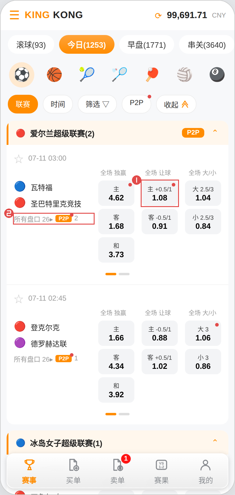

| 序号 | 说明 |
|---|---|
| ① | **点击赔率格**选中你想卖出的投注项。这里选的是「瓦特福 vs 圣巴特里克竞技」的「主 +0.5/1」。格子右上角的红点表示该投注项已经有人挂了高于官方赔率的 P2P 挂单 |
| ② | 「所有盘口 26▸」可进入该场比赛的全部盘口页面挑选；旁边的「P2P 2」表示这场比赛有 2 个投注项已有 P2P 挂单 |

> **选什么好卖**：优先选已有 P2P 挂单（有红点）的投注项，说明这里有买家在关注；同时你要判断该投注项**不容易中**，才适合卖出。

---

## 第二步 · 切换到「卖出」页

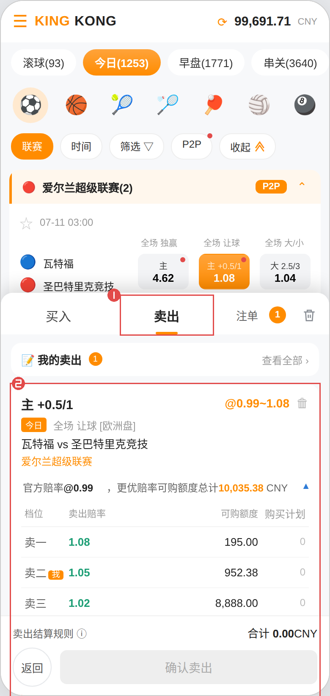

| 序号 | 说明 |
|---|---|
| ① | 选中投注项后购物车会自动弹出，默认在「买入」页。**点击「卖出」**切换到卖出页 |
| ② | 卖出卡片，展示你要卖的投注项、赛事与联赛，确认无误再往下填 |

> 顶部「我的卖出」旁的数字是你当前进行中的挂单数，点「查看全部 ›」可跳到卖单页。

---

## 第三步 · 看行情表决定你的价格

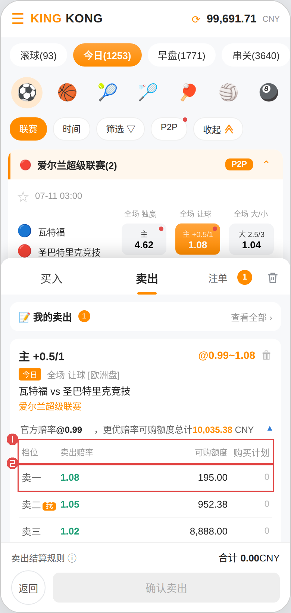

| 序号 | 说明 |
|---|---|
| ① | 表头依次是**档位 / 卖出赔率 / 可购额度 / 购买计划**，这是当前该投注项的全部在售挂单 |
| ② | 每一行是一个卖家的挂单。赔率从高到低排列，**赔率最高的排在最前面（卖一），最先被买走**。标着「我」的是你自己的挂单；最后一行「官方」是平台盘，额度无限 |

> **定价的关键**：买家总是从赔率最高的档位开始买。你的赔率如果低于卖一，就要等前面的额度被买完才轮到你；给得比卖一高，你就会排到最前面优先成交，但赔付也更高。表头上方的「官方赔率 @0.99」是你的定价基准。

---

## 第四步 · 填押金、设上浮点位

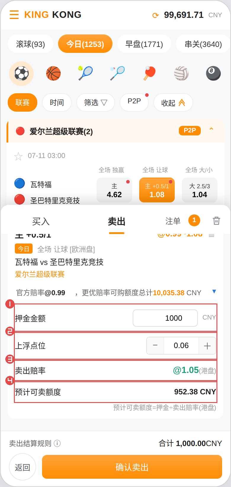

| 序号 | 说明 |
|---|---|
| ① | **押金金额**：你愿意投入的担保金额，确认后从余额冻结。这里填 1,000 |
| ② | **上浮点位**：在官方赔率基础上加的点数，用 − / ＋ 调整（步进 0.01，可以填负数）。这里填 0.06 |
| ③ | **卖出赔率**（自动算出）= 官方赔率 + 上浮点位 = 0.99 + 0.06 = **@1.05**，这是买家看到的价格，不可直接编辑 |
| ④ | **预计可卖额度**（自动算出）= 押金 ÷ 卖出赔率 = 1000 ÷ 1.05 = **952.38 CNY**，这是你这笔挂单最多能被买走的金额 |

> **点位怎么给**：点位越高，卖出赔率越高、越容易被买走，但同样的押金能卖的额度就越少（分母变大），而且赔付更多。点位为负会让你的赔率低于官方赔率，几乎不会成交，界面会红字提示「低于官方」。

---

## 第五步 · 确认卖出

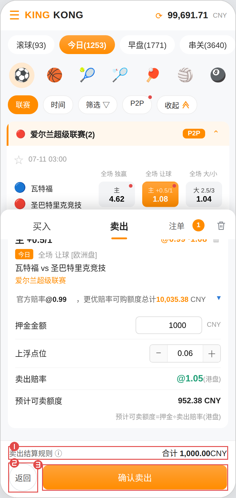

| 序号 | 说明 |
|---|---|
| ① | **卖出结算规则**：第一次做庄建议点开看一遍，了解赛果如何决定你的盈亏 |
| ② | 「返回」收起购物车回到赛事列表，已填内容会保留 |
| ③ | **确认卖出**：点击后押金立即冻结，挂单进入卖单簿开始接受买家购买 |

> 底部「合计」是本次全部挂单要冻结的押金总额。押金冻结后会一直占用到赛事结算，请留足余额。

---

## 第六步 · 在卖单页查看你的挂单

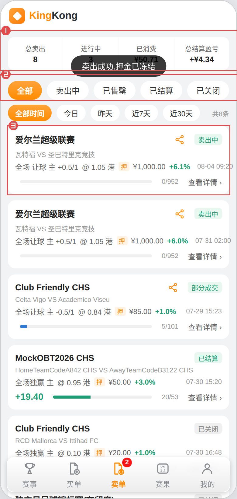

| 序号 | 说明 |
|---|---|
| ① | **统计区**：总卖出笔数、进行中笔数、已消费金额（已被买走的额度）、总结算盈亏 |
| ② | **状态筛选**：全部 / 卖出中 / 已售罄 / 已结算 / 已关闭，下面一行是时间筛选 |
| ③ | **挂单卡片**：联赛、状态标签、赛事、玩法与投注项、卖出赔率、押金、上浮点位百分比、卖出时间；底部进度条是消费进度，右侧「查看详情 ›」进入挂单详情 |

> 挂单状态含义：**卖出中** = 还没有人买；**部分成交** = 已被买走一部分；**已售罄** = 额度全部卖完；**已结算** = 赛事已出结果、盈亏已入账；**已关闭** = 你主动停止收单或被平台下架。

---

## 第七步 · 挂单详情与收单期间的管理

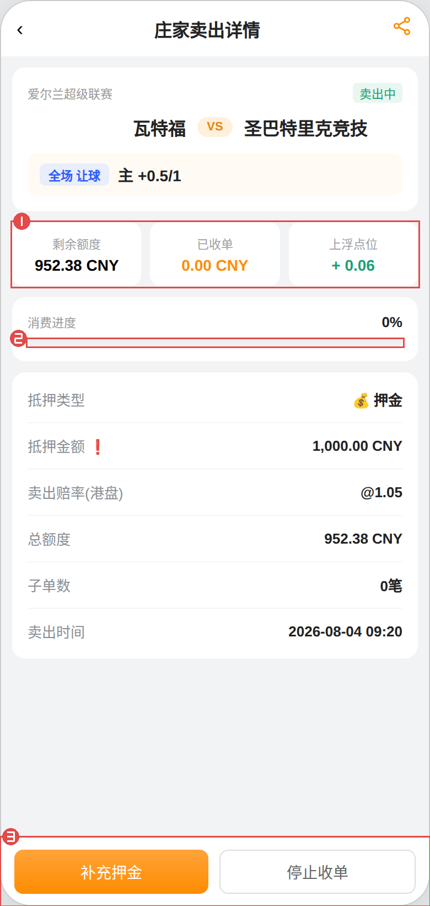

| 序号 | 说明 |
|---|---|
| ① | **剩余额度 / 已收单 / 上浮点位**：剩余额度是还能被买走的金额，已收单是已经被买走的金额 |
| ② | **消费进度**：已收单 ÷ 总额度，直观看这笔挂单卖得怎么样 |
| ③ | **补充押金 / 停止收单**：收单期间的两个操作，见下方两节 |

中间的信息区还有：抵押类型与金额（点金额旁的红色感叹号可看押金变动记录）、卖出赔率、总额度、子单数、卖出时间。有人买入后，下方会出现**会员买单列表**，逐笔显示买家、成交金额与时间；赛事结算后这里还会显示每笔的结算金额、平台抽水与卖出返回。

---

### 补充押金（想多卖一些）

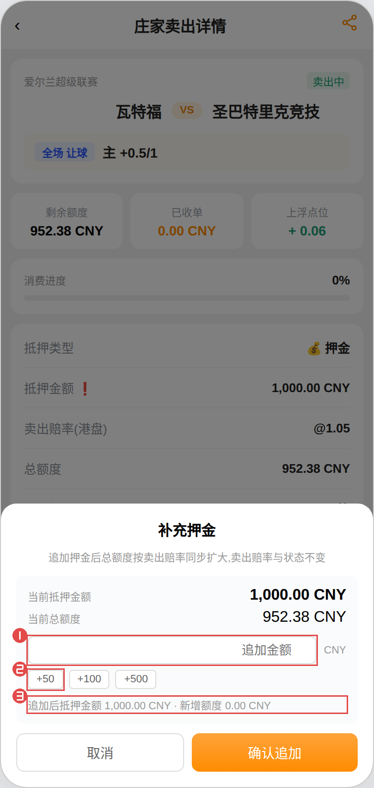

| 序号 | 说明 |
|---|---|
| ① | 输入要追加的金额 |
| ② | 快捷金额 +50 / +100 / +500 |
| ③ | 实时预览追加后的抵押金额与**新增额度**（追加金额 ÷ 卖出赔率） |

追加的押金同样从余额冻结。卖出赔率与挂单状态不变，只是总额度变大、能卖更多；已售罄的挂单追加后会重新开始收单。

---

### 停止收单（不想再卖了）

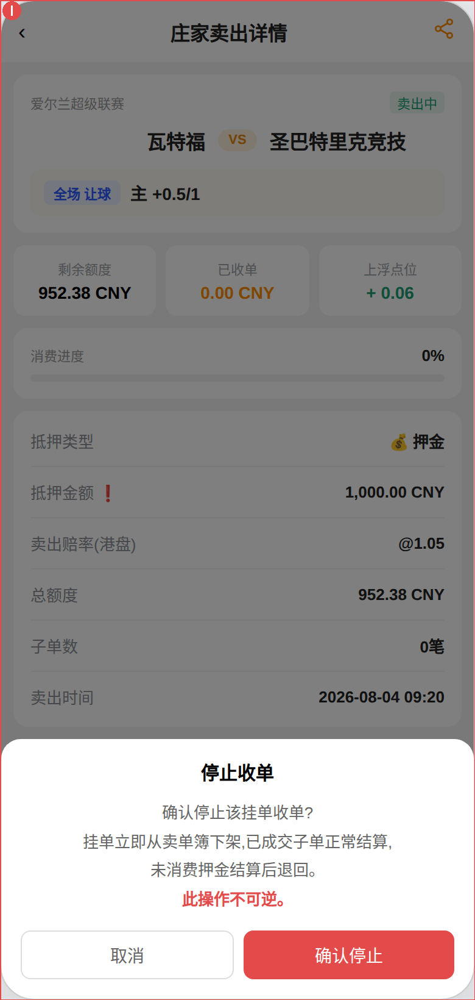

| 序号 | 说明 |
|---|---|
| ① | 二次确认弹窗。确认后挂单**立即从卖单簿下架**，不再接受新的买入 |

要点：**此操作不可逆**。已经成交的部分照常等赛事结算，未被消费的押金在结算后退回。

---

## 第八步（可选）· 把挂单分享出去

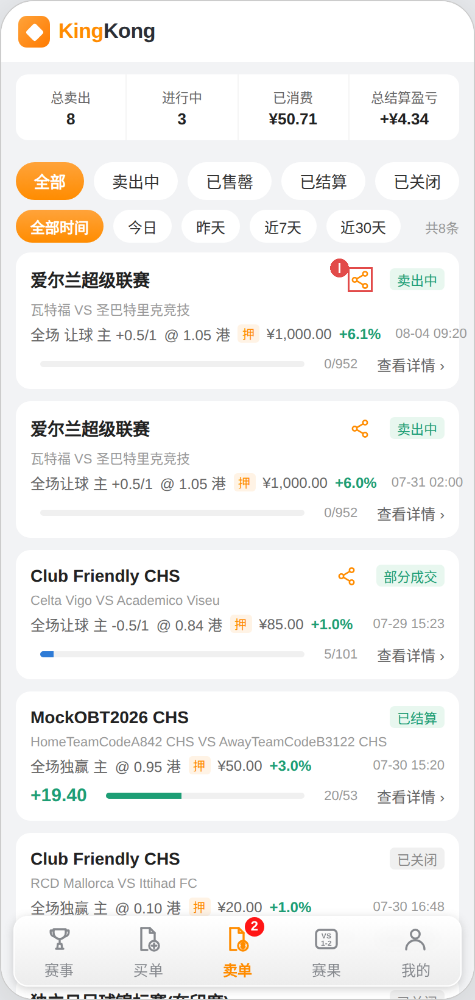

| 序号 | 说明 |
|---|---|
| ① | 卖单卡片右上角的**分享图标**（挂单详情页顶栏右上角也有），点击弹出分享层 |

分享层里可以复制链接，或分享到金刚 / Telegram。好友点开后能看到这笔挂单的赛事、玩法、投注项、赔率与状态，点击即可直接进入投注。挂单失效（售罄、封盘、关闭、结算、赛事已开赛）后分享图标会隐藏。

---

## 新手常见问题

**押金会被扣掉吗？**
确认卖出时只是**冻结**，不是扣除。赛事结算后押金全额解冻退回，盈亏另行入账。

**为什么我的挂单一直没人买？**
大概率是赔率不够高。回到卖出页看行情表，如果你的档位排在卖一后面，就要等前面额度被买完；可以停止收单后用更高的点位重新挂，或直接补充押金并不改价继续等。

**赔付会超过押金吗？**
不会。系统在你每笔成交时按「成交金额 × 卖出赔率」占用押金，这是该笔的最大赔付额，所以即使全部赛果对你不利，总赔付也不会超过押金。

**卖出后还能改赔率吗？**
本期不支持改价。需要调价请先停止收单，再用新的点位重新挂单（已成交部分不受影响）。

**赛事结算后钱怎么算？**
该投注项**没中** → 买家的投注金额归你（扣平台抽水）；**中了** → 按卖出赔率从押金赔付给买家。挂单详情页会显示每笔子单的结算金额、平台抽水与最终的卖出返回金额。

---

## 附：首次进入的新手引导

新会员**第一次进入金刚体育**时会自动弹出四步引导，覆盖大厅的核心概念；点「知道了」或「跳过」后不再展示，老会员不触发。需要重看时，在「我的 → 重看新手引导」可再次打开。

| 图A 第1步 · 看懂赔率格 | 图B 第2步 · 快速筛选 P2P |
|---|---|
| 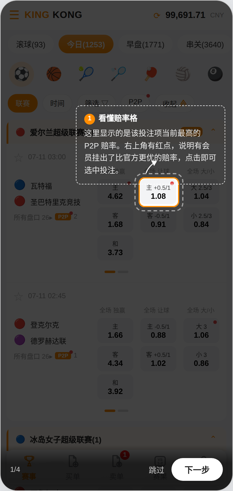 | 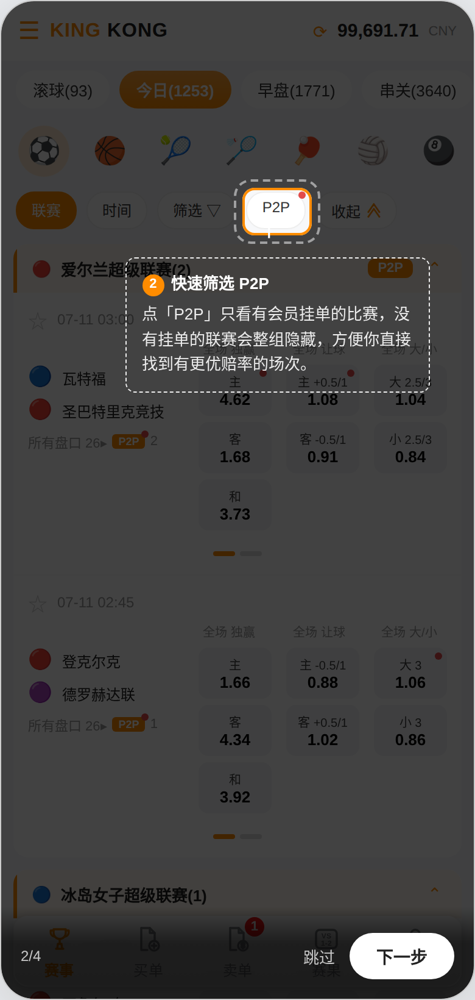 |

| 图C 第3步 · 进入更多盘口 | 图D 第4步 · 买单与卖单 |
|---|---|
| 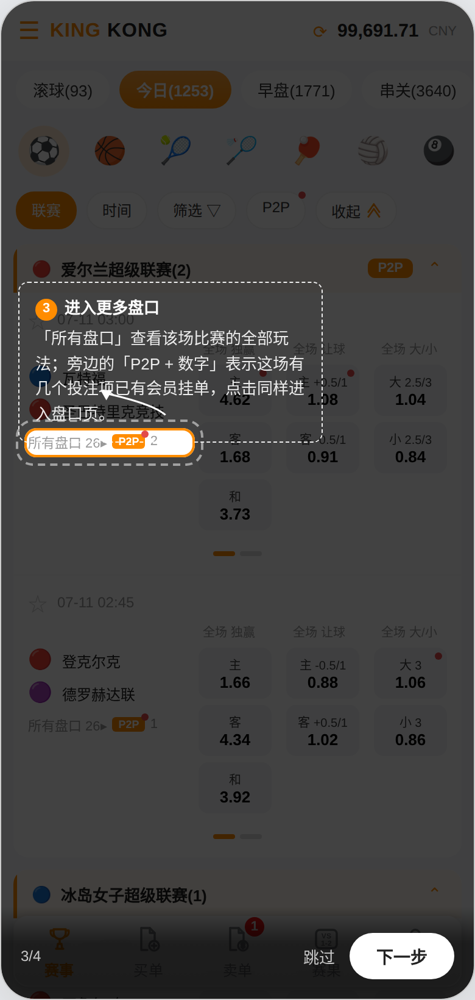 | 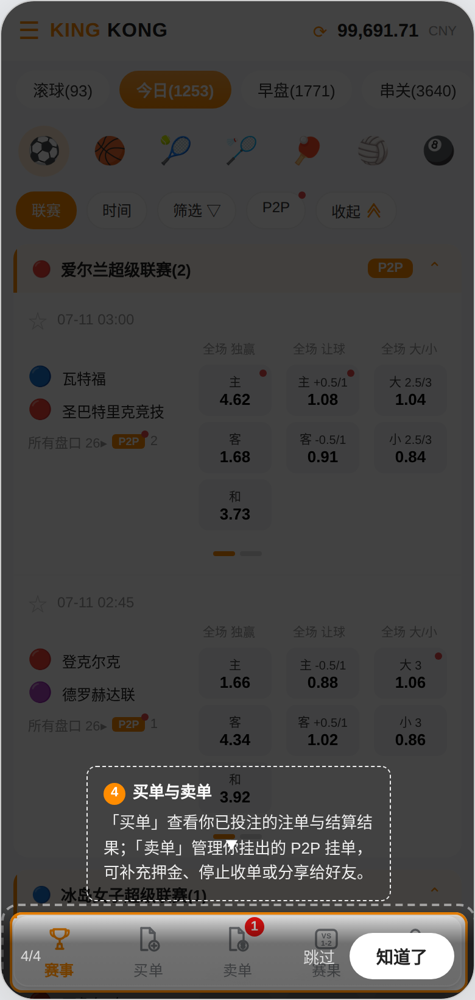 |

| 步骤 | 高亮目标 | 引导文案 |
|---|---|---|
| 1/4 | 赛事大厅的赔率格 | 这里显示的是该投注项当前最高的 P2P 赔率。右上角有红点，说明有会员挂出了比官方更优的赔率，点击即可选中投注 |
| 2/4 | 筛选行「P2P」胶囊 | 点「P2P」只看有会员挂单的比赛，没有挂单的联赛会整组隐藏，方便你直接找到有更优赔率的场次 |
| 3/4 | 比赛卡片的「所有盘口 / P2P」入口 | 「所有盘口」查看该场比赛的全部玩法；旁边的「P2P + 数字」表示这场有几个投注项已有会员挂单，点击同样进入盘口页 |
| 4/4 | 底部导航 | 「买单」查看你已投注的注单与结算结果；「卖单」管理你挂出的 P2P 挂单，可补充押金、停止收单或分享给好友 |

**交互规则**

- 遮罩覆盖全屏，仅高亮当前步骤的目标元素（橙色描边 + 白色虚线圈），其余区域不可点击；
- 气泡为白色虚线框，含步骤序号、标题与说明，并有曲线箭头指向目标；目标偏上时气泡显示在下方，反之在上方；
- 底部固定：左侧步骤进度（1/4），右侧「跳过」与「下一步」，最后一步按钮文案变为「知道了」；
- 目标不在可视区时自动滚动到屏幕中部再高亮。

**触发与记录**

- 触发时机：首次进入体育大厅，页面加载完成后自动展示；
- 记录方式：读到「已看过」标记则不展示。原型用内存变量演示，**上线需持久化**——建议记在会员档案（跨设备一致），或退而求其次记在本地存储（换设备会重复展示）；
- 重看入口：我的 → 重看新手引导。

---

*— 教程结束 —*
